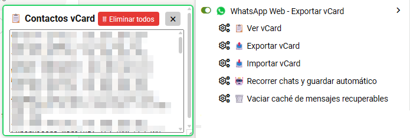

# WhatsApp Web - Exportar vCard

**Última Actualización:** 23 de julio de 2026

Guarda fácilmente contactos de **WhatsApp Web** en formato **vCard (.vcf)**, administra una lista local, recorre automáticamente los chats para obtener números y exporta o importa contactos desde un panel flotante.

## 📖 Descripción

**WhatsApp Web - Exportar vCard** es un UserScript para **Tampermonkey** que añade nuevas funciones a **WhatsApp Web**, permitiendo crear una colección de contactos sin depender de la agenda del teléfono.

El script detecta automáticamente el número real desde la información del contacto, incluso cuando este ya tiene un nombre guardado en WhatsApp. Los contactos pueden almacenarse localmente, editarse desde un panel flotante y exportarse posteriormente como archivos **vCard (.vcf)** compatibles con la mayoría de teléfonos y aplicaciones de contactos.

Además, incorpora un recorrido automático de los chats visibles para guardar contactos de forma masiva y una función para mostrar mensajes eliminados que previamente hayan sido cargados en la sesión actual.

---

# 📥 Instalación

1. Instala la extensión **Tampermonkey** para tu navegador.

2. Instala el script desde GitHub:

**➡️ [Instalar Script](https://github.com/wernser412/WhatsApp-Web_Exportar-vCard/raw/refs/heads/main/WhatsApp%20Web%20-%20Exportar%20vCard.user.js)**

---

# ✨ Características

* 📇 Guardar contactos directamente desde WhatsApp Web.
* ➕ Botón para añadir contactos desde la información del contacto.
* ✅ Detecta automáticamente contactos ya guardados.
* 📄 Exportación de contactos en formato **vCard (.vcf)**.
* 📥 Importación de archivos **vCard (.vcf)**.
* 📝 Panel flotante editable para administrar contactos.
* 💾 Almacenamiento local mediante Tampermonkey.
* 🚀 Recorrido automático de los chats visibles.
* 🔍 Obtiene el número real del contacto desde su ficha.
* 👥 Detección automática de grupos para omitirlos.
* 🎨 Resalta los chats cuyos contactos ya fueron guardados.
* 📍 Recuerda la posición del panel flotante.
* 🗑️ Eliminación rápida de todos los contactos almacenados.
* 📨 Recuperación visual de mensajes eliminados que hayan sido vistos previamente.
* 🧹 Opción para limpiar el caché de mensajes recuperables.

---

# 🖥️ Uso

## Guardar un contacto

1. Abre un chat individual.
2. Entra en la información del contacto.
3. Pulsa **➕ Guardar en vCard**.
4. El contacto quedará almacenado localmente.

## Exportar contactos

Desde el menú de Tampermonkey selecciona:

**📤 Exportar vCard**

Se descargará un archivo **.vcf** con todos los contactos guardados.

## Importar contactos

Desde el menú de Tampermonkey selecciona:

**📥 Importar vCard**

Selecciona un archivo **.vcf** y los contactos nuevos se añadirán automáticamente evitando duplicados.

---

# 🤖 Recorrido automático

El script incluye una función capaz de recorrer automáticamente todos los chats visibles en la barra lateral.

Durante el proceso:

* Abre cada conversación.
* Accede a la información del contacto.
* Obtiene el número telefónico.
* Omite automáticamente los grupos.
* Evita guardar contactos duplicados.
* Guarda únicamente contactos nuevos.

> **Importante:** Solo se procesan los chats que estén cargados actualmente en la lista. Si tienes más conversaciones, desplázate hacia abajo y vuelve a ejecutar la función.

---

# 📨 Recuperación de mensajes eliminados

Mientras WhatsApp Web permanece abierto, el script guarda localmente el contenido de los mensajes que llegan a mostrarse en pantalla.

Si posteriormente alguno de ellos es eliminado y aparece el aviso **"Este mensaje fue eliminado"**, el script mostrará debajo el texto previamente almacenado.

> **Importante:** Esta función **no recupera mensajes antiguos** ni aquellos que nunca llegaron a mostrarse en la pestaña abierta. Solo funciona con mensajes visibles durante la sesión actual.

---

# 💾 Información almacenada

El script guarda automáticamente:

* Lista de contactos.
* Posición del panel flotante.
* Caché temporal de mensajes recuperables.

Toda la información permanece únicamente en el almacenamiento local de Tampermonkey.

---

# 📄 Requisitos

* Navegador compatible con **Tampermonkey**.
* Acceso a **WhatsApp Web**.
* Sesión iniciada en WhatsApp Web.

---

# 📄 Licencia

Este proyecto se distribuye bajo la licencia **MIT**.

Consulta el archivo **LICENSE** para más información.
